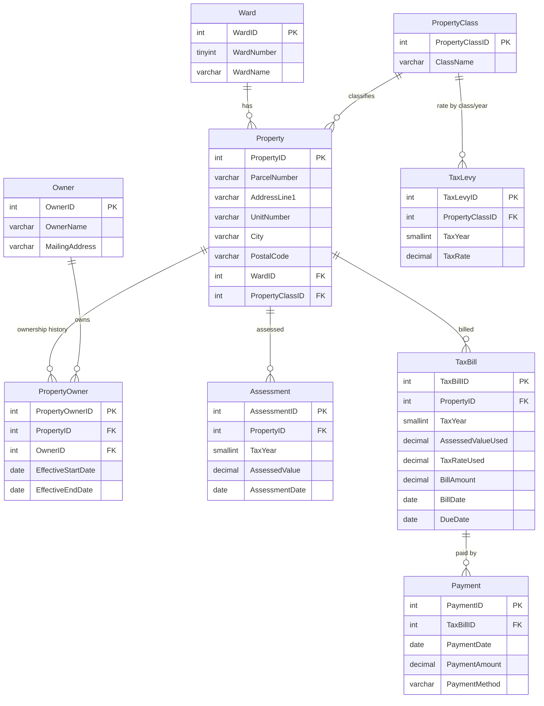
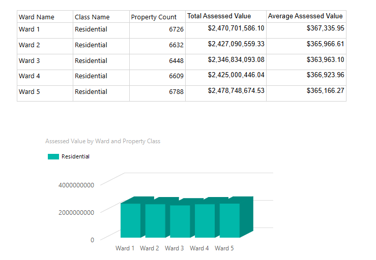
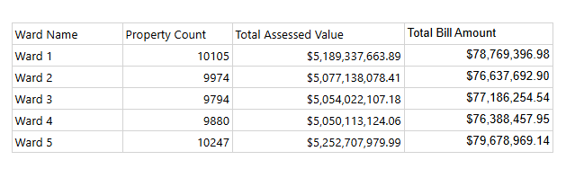
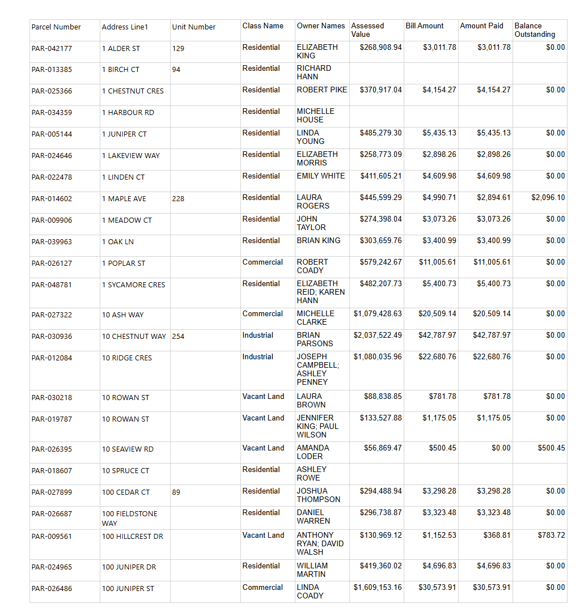
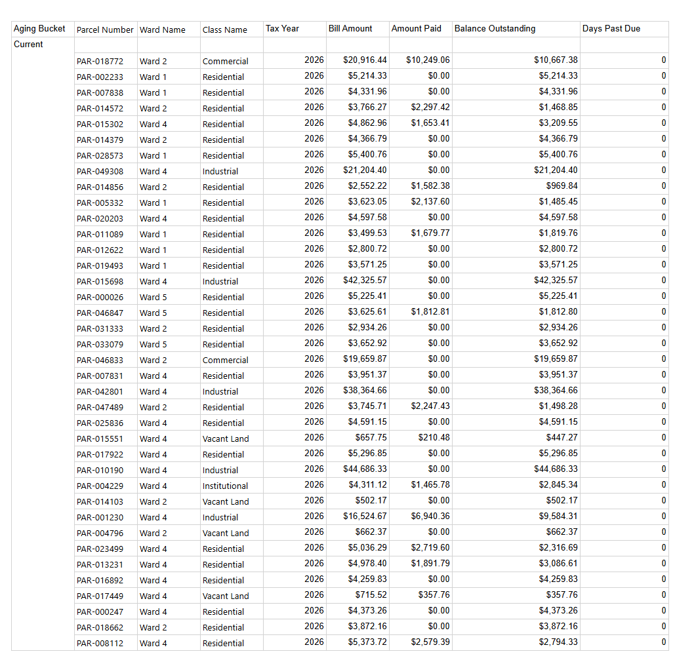
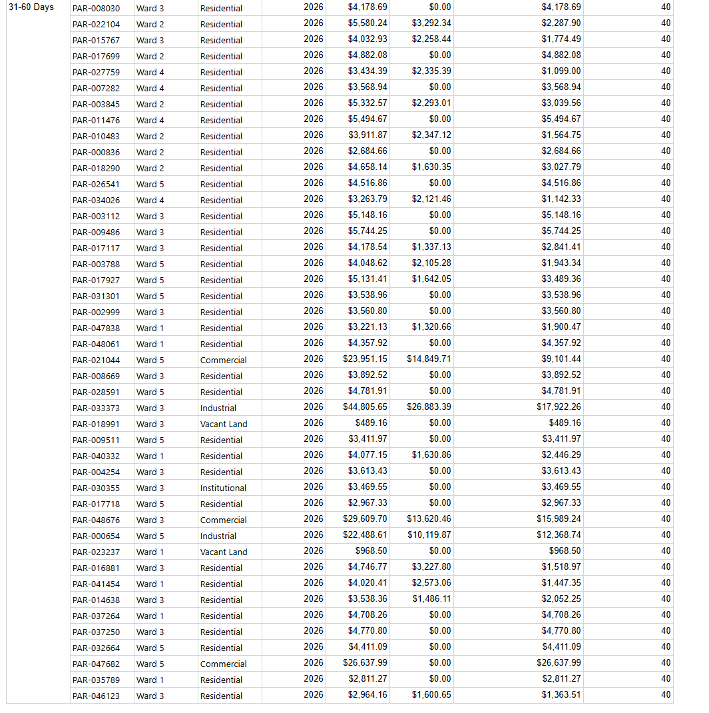
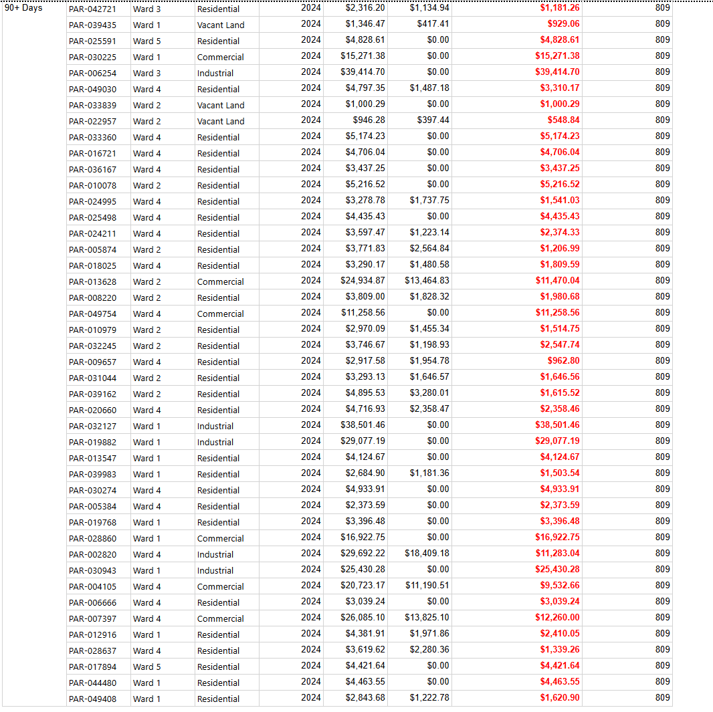
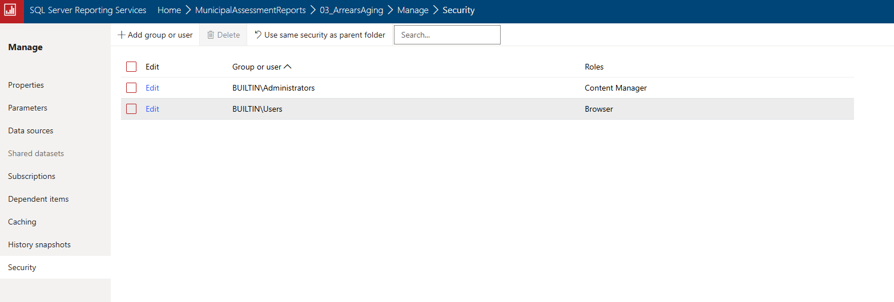
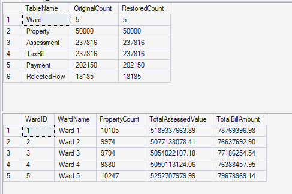

# Municipal Assessment & Tax Reporting

SQL Server + SSRS reporting environment built against a municipal property assessment and taxation domain.

**This is a simplified practice model, not a reconstruction of the City of St. John's real taxation system or business rules.** All property, owner, assessment, tax, and payment data is entirely synthetic — generated for this project. The only element drawn from reality is the ward structure (the City of St. John's genuinely has 5 wards, numbered Ward 1–5); everything else — rates, addresses, owner names, billing dates, arrears/aging rules — is invented and does not reflect actual municipal figures or policy. The claim this project supports is "a working SQL Server/SSRS environment covering a relevant domain," not "knowledge of how municipal taxation actually works."

---

## Architecture

Staging → transform → normalized schema → reporting views/procedures → SSRS reports, with a `RejectedRow` log capturing everything the transform rejects rather than silently dropping it.



**Data volume:** 50,000 properties, 5 tax years (2022–2026), 237,816 assessments/bills, 202,150 payments, 18,185 deliberately-generated defects caught and logged by the transform (see below).

**Repository layout:**

```
/database
    schema/       DDL, plus the one tuning index (03_tuning_indexes.sql)
    staging/      synthetic data generation, deliberately messy
    transform/    staging -> normalized, with rejection logging
    views/        reporting views
    procedures/   parameterized stored procedures (report datasets)
    security/     least-privilege reporting role
    jobs/         backup, restore test, maintenance -- scripted, not just run once
/reports          the 3 .rdl reports
/performance      before/after tuning evidence
/docs             screenshots, decisions log
subscription-output/  local target for the scheduled subscription (git-ignored)
```

---

## Design decisions

### Effective-dated ownership

`PropertyOwner` is a many-to-many table between `Property` and `Owner`, dated with `EffectiveStartDate`/`EffectiveEndDate` rather than a single "current owner" column. A property can change hands mid-year, and can have co-owners at once (two rows, same property, overlapping dates). "Current owner" means the row where `EffectiveEndDate IS NULL` — this is used directly in `vw_CurrentPropertyOwnership`. A property can also legitimately have **no** current owner on record: 1,550 properties fall into this state, because their ownership record was rejected during transform (see Assumptions) while the property itself was still valid and kept.

### Historical bill preservation

`TaxBill.AssessedValueUsed` and `TaxBill.TaxRateUsed` are copied from `Assessment`/`TaxLevy` at bill-generation time and never recalculated. If an assessment or tax rate is corrected later, every bill already issued still shows exactly what it said when it was generated. This is deliberate denormalization — a snapshot/audit record, not a live view — and it's the standard defect this schema is designed to avoid: reprinting an old bill at a new rate.

### Index choices

Beyond the primary keys (clustered, auto-created):

| Index | Reason |
|---|---|
| `UQ_Property_ParcelNumber` | Enforces the real-world parcel number as unique; also the join key used throughout the transform (staging text -> real `PropertyID`) |
| `UQ_Assessment_Property_TaxYear`, `UQ_TaxBill_Property_TaxYear` | Enforce "one assessment/bill per property per year" (a documented assumption below); also the exact join shape used by every reporting procedure filtering on `PropertyID + TaxYear` |
| `UQ_TaxLevy_PropertyClass_TaxYear`, `UQ_PropertyClass_ClassName`, `UQ_Ward_WardNumber` | Lookup uniqueness |
| `IX_Payment_TaxBillID INCLUDE (PaymentAmount)` | Added for a measured reason, not preemptively — see the tuning section below. Makes the per-bill payment sum in `vw_TaxBillPaymentStatus` a seek instead of a scan-and-spool. |

No index exists on `Property.WardID` or `Property.PropertyClassID` — deliberately. Measured performance across all four reporting procedures before adding anything (see tuning section); those columns were never the bottleneck, and adding indexes without a measured reason was avoided on purpose.

---

## Assumptions

- **Owner identity is resolved by normalized name matching, not a persistent owner ID.** Casing/whitespace defects are cleaned before matching, which is also how near-duplicate names collapse into one `Owner` row. Two distinct real owners who happened to share an identical cleaned name would be incorrectly merged into one. Real systems avoid this by assigning an owner ID at intake rather than deriving identity from name text — out of scope here.
- **One assessment and one bill per property per tax year.** Enforced by `UNIQUE` constraints. A reasonable simplification for a practice schema.
- **Bill timing:** `BillDate = AssessmentDate + 110 days`, `DueDate = BillDate + 60 days`. Chosen deliberately so the most recent tax year's due dates land near "today," giving the arrears report genuine spread across aging buckets rather than everything defaulting to the oldest bucket — but it also reflects a real, common municipal pattern (assessment early in the year, billing mid-year). Not a claim about the real billing calendar.
- **Arrears aging buckets** (Current / 1-30 / 31-60 / 61-90 / 90+ days past due), **partial payment behavior**, and the general concept of "arrears" here are assumptions for exercising date arithmetic and exception reporting — not a description of real municipal collections policy.
- **`PaymentMethod` is a plain column**, not a lookup table like `Ward`/`PropertyClass` — a deliberate scope decision (the spec fixes the schema at nine tables), not an oversight.
- **`Ward` is the one real element** (5 wards, Ward 1–5, matching the actual City of St. John's council structure). `PropertyClass`, `TaxLevy` rates, addresses, and owners are entirely synthetic and seeded/generated directly rather than run through the staging/transform pipeline used for property, assessment, and payment data — there's no messy "real" source for config data like tax rates to justify treating it as an ETL problem.

Full reasoning and a few more minor calls are in [`docs/decisions-log.md`](docs/decisions-log.md), written as they happened during the build — including three real SQL Server bugs hit and fixed along the way (a `NEWID()`-based random-pick pattern that silently lost randomness, an `ABS(CHECKSUM(NEWID()))` integer overflow, and a runaway parallel query plan diagnosed live with `sys.dm_exec_requests`).

---

## Reports

| # | Report | Demonstrates |
|---|---|---|
| 1 | Assessment totals by ward and property class | Parameters (tax year, class), stored-procedure aggregation, clustered column chart |
| 2 | Ward summary → property detail | Drill-through navigation, passing both a dataset field and a report parameter across reports |
| 3 | Accounts in arrears with aging buckets | Business logic, `DATEDIFF` date arithmetic, exception reporting (bold/red flagging of the worst bucket) |

Screenshots: see `docs/screenshots/`.

*(Screenshot placeholders below — see the "Screenshots to add" section at the bottom of this file.)*



Report 2, before and after the drill-through click — the ward-level summary, and the property-level detail it navigates to:




Report 3, showing three of the five aging buckets in the correct order (`Current` → `31-60 Days` → `90+ Days`), and the exception-formatting only kicking in on the worst bucket (`Balance Outstanding` in bold red, only when `AgingBucket = '90+ Days'`):





---

## Security model

Two layers, deliberately independent of each other (per the spec: "both layers together are the point — either alone is weaker").

### Database layer

A dedicated login (`ssrs_reporting_svc`) in role `ReportingRole`, granted:
- `EXECUTE` on the 5 reporting stored procedures
- `SELECT` on the 2 reporting views

Nothing else — no access to any of the 9 base tables, the staging tables, or `RejectedRow`. This was verified with a negative test, not just by reading the `GRANT` statements: connected to SQL Server *as* `ssrs_reporting_svc` and confirmed it can run `rpt_WardSummary` and query `vw_CurrentPropertyOwnership`, but gets `Msg 229` (permission denied) trying `SELECT * FROM Property` or `SELECT * FROM RejectedRow`.

### Report server layer

`03_ArrearsAging` (the report with the most sensitive financial detail) has broken permission inheritance from its parent folder. `BUILTIN\Administrators` keeps `Content Manager` (can manage/edit); `BUILTIN\Users` is granted only `Browser` (can view/run, nothing else):



The shared data source (`MunicipalAssessmentDS`) itself connects using the `ReportingRole` login, not a personal Windows account or Windows-integrated passthrough — meaning every report and the subscription runs under the same least-privilege identity the database layer enforces, not under whoever happens to be signed in.

---

## SQL Server administration

| Job | Script | What it does |
|---|---|---|
| Full backup | `database/jobs/01_backup_job.sql` | Nightly (1 AM), compressed, checksummed, timestamped filename so runs don't overwrite each other |
| Test restore + verification | `database/jobs/02_test_restore.sql` | Restores the latest backup to `MunicipalAssessment_RestoreTest` (a second database, not overwriting the original); verifies by comparing row counts against the original across 6 tables **and** by running `rpt_WardSummary` against the restored copy |
| Maintenance | `database/jobs/03_maintenance_job.sql` | Weekly (Sunday 2 AM); rebuilds indexes ≥30% fragmented, reorganizes 5–30%, leaves the rest alone, then updates statistics |

The restore is the part that actually matters — it proves the backup is usable, not just that a `.bak` file exists. All 6 tables checked (`Ward`, `Property`, `Assessment`, `TaxBill`, `Payment`, `RejectedRow`) matched the original exactly, and a real reporting procedure ran correctly against the restored copy:



Explicitly out of scope, per the spec: differential backups, backup retention/cleanup strategy, Query Store.

---

## Query tuning exercise

Full writeup: [`performance/tuning-notes.md`](performance/tuning-notes.md). Summary:

`rpt_ArrearsAging` was measurably the worst-performing report (4x slower than the next worst), because `vw_TaxBillPaymentStatus` summed `Payment` per bill via a correlated subquery with no index to seek on. Added one covering index (`IX_Payment_TaxBillID INCLUDE (PaymentAmount)`) for that specific, measured reason.

| Metric | Before | After | Change |
|---|---|---|---|
| Elapsed time | 3,847 ms | 1,935 ms | ~50% faster |
| CPU time | 5,547 ms | 4,171 ms | ~25% less |
| Logical reads (payment lookup path) | 1,202,754 | 759,495 | ~37% fewer |

A modest, honest improvement — the report still touches every unpaid bill and every payment, because that's inherent to what an aging report has to compute. What changed is a scan-and-spool becoming a seek.

---

## Screenshots to add

Save these into `docs/screenshots/` with the exact file names below (the links above will then resolve automatically):

1. `report1-assessment-totals.png` — Report 1 rendered in the browser, table + chart visible ✅
2. `report2-drillthrough-summary.png` and `report2-drillthrough-detail.png` — Report 2's ward summary and the property detail it drills into ✅
3. `report3-arrears-current.png`, `report3-arrears-31to60.png`, `report3-arrears-90plus.png` — Report 3's bucket ordering and exception formatting ✅
4. `security-folder-permissions.png` — the SSRS Security screen showing `BUILTIN\Administrators` (Content Manager) and `BUILTIN\Users` (Browser) on `03_ArrearsAging` ✅
5. `restore-verification.png` — SSMS or a query result showing the row-count comparison between `MunicipalAssessment` and `MunicipalAssessment_RestoreTest` ✅
